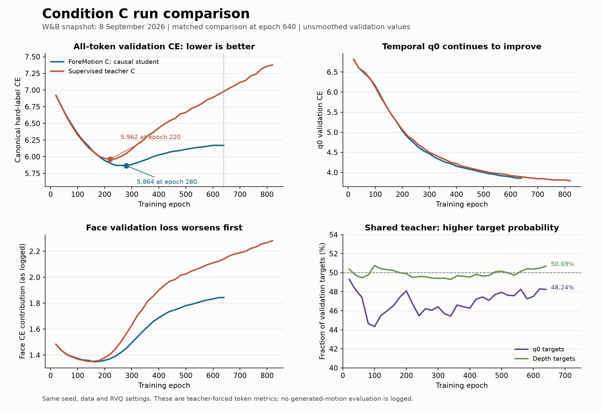

# Condition C: W&B run analysis

The current evidence favors ForeMotion's causal student on validation token
prediction, particularly late in training. The directly supervised C teacher
fits the training set faster but develops substantially worse depth/face
validation loss. ForeMotion's own shared-weight C teacher is almost identical
to its causal student on paired validation metrics; these runs do not establish
a useful predictive advantage from future speech.

This report focuses on the two new condition-C runs in the 18-run project:
[foremotion-c-rvq-scott-bs64](https://wandb.ai/wenjye00-hong-kong-university-of-science-and-technology/miburi_single/runs/0st12z6a)
and
[teacher-c-supervised-rvq-scott-bs64](https://wandb.ai/wenjye00-hong-kong-university-of-science-and-technology/miburi_single/runs/8hir7gzc).
Both were running at retrieval. The snapshot was downloaded on 8 September 2026
at 11:01:55 UTC / 19:01:55 China time, using the run-summary step limits captured
a few minutes earlier. Later live values can differ from this fixed snapshot.

## Matched comparison

Teacher-only history covers training through epoch 828 and validation through
820. ForeMotion covers training through 659 and validation through 640. Compare
the same validation epoch rather than the latest value in each live summary.

| Metric | ForeMotion causal student | Supervised C teacher |
| --- | ---: | ---: |
| Best overall validation CE | **5.864194 at epoch 280** | 5.962052 at epoch 220 |
| Overall validation CE at epoch 640 | **6.168554** | 6.977771 |
| q0 validation CE at epoch 640 | **3.859375** | 3.890625 |
| q0 accuracy at epoch 640 | **25.0222%** | 24.3259% |
| q0 top-5 accuracy at epoch 640 | **50.0741%** | 49.0370% |
| Upper-body CE contribution at epoch 640 | **2.564361** | 2.706302 |
| Lower-body CE contribution at epoch 640 | **1.760299** | 2.130795 |
| Face CE contribution at epoch 640 | **1.843894** | 2.140674 |

ForeMotion's total CE is 11.60% lower at epoch 640, but its best-versus-best
advantage is only 1.64%. The widening late gap primarily reflects different
degrees of validation deterioration. ForeMotion wins total validation CE at
26 of the 32 shared validation checkpoints; those checkpoints are correlated
observations from one seed, not independent experimental replications.

The part metrics above are the logged contributions to the all-codebook
average, not separate per-part mean CEs. Upper, lower, and face have different
numbers of codebooks, so compare each row across runs rather than comparing
their raw magnitudes against one another.

## Temporal learning and depth overfitting separate

From teacher-only epoch 220 to 820, overall validation CE worsens from 5.962052
to 7.377294, a 23.74% increase. Over the same interval its training CE objective
falls from 7.026862 to 3.754240. Meanwhile q0 validation CE improves from 4.90625
to 3.796875, and q0 accuracy rises from 14.7111% to 25.0519%.

The degradation is concentrated in depth outputs: the face contribution rises
from 1.406142 to 2.281851 and lower-body contribution from 1.925302 to 2.374510.
Weighted depth hard CE rises from 7.8125 to 10.625. Face validation loss reaches
its minimum particularly early, at teacher epoch 140.

ForeMotion also shows validation deterioration after its total-CE minimum at
280, but its total CE increases only 5.19% by 640. The face contribution rises
from 1.452732 to 1.843894 while upper/lower contributions improve slightly.
Its face minimum occurs at epoch 160.

These longitudinal trends support depth/face overfitting or increasing
overconfidence on held-out targets. They do not imply that temporal learning
has stalled, nor establish the quality of free-running generated motion.
For total-token checkpoint selection, prioritize teacher `last_220.safetensors`
and ForeMotion `last_280.safetensors`; also evaluate later checkpoints if temporal
planning is the target. These filenames follow the configured saving schedule;
remote checkpoint-file presence was not checked.

## Is the shared teacher actually stronger?

Within ForeMotion, the teacher and causal student use identical weights and
gesture prefixes. At epoch 640, the directly paired validation diagnostics are:

| Paired metric | Causal student | Shared C teacher |
| --- | ---: | ---: |
| q0 CE | 3.851522 | 3.851217 |
| q0 accuracy | **25.0222%** | 24.9630% |
| Depth CE | 6.290479 | 6.288444 |
| Depth accuracy | 9.8308% | 9.8339% |

The teacher assigns higher probability to the correct target on 48.2370% of
q0 positions and 50.6947% of depth positions. These are target-probability win
rates, not accuracy gains. Across all 32 validation points, the shared teacher
has lower q0 CE only 4 times and lower depth CE 16 times. Average q0 CE is
approximately 0.001 higher for the teacher. The future-aware view is therefore
not a clearly stronger supervisor in the observed validation data.

Raw validation KL at epoch 640 is 0.003278; epoch training KL is 0.059819.
The weighted training KL is 0.358913, about 8.35% of the training CE component
4.299520. Thus the regret term can materially regularize training even though
the clean validation predictions nearly coincide. Independently sampled
training dropout is one plausible contributor to that discrepancy. These two
runs alone cannot distinguish useful future knowledge from a more generic
consistency-regularization effect.

The paired regret diagnostics remove the PAD class and compute CE in float32.
The main q0 CE includes PAD in normalization and can be rounded by bfloat16
computation. This explains why paired student q0 CE above is not numerically
identical to the main q0 CE in the first table; use each matched metric family
for its intended comparison.

## Configuration, data, and cost

The logged configurations match on seed 2342, Scott data/split, batch 64,
architecture, codec checkpoints, RVQ settings, face weighting, modality dropout,
VAD/contrastive auxiliaries, and learning-rate schedule. ForeMotion's regret
weight ramps from 0.6 to 6 over one epoch; teacher-only regret is zero. Teacher
regret start/ramp defaults are inactive because it has no regret objective.

Both runs report 477 training clips, 54 validation clips, 89 test clips, and
320,812,552 trainable parameters. This is a small single-speaker dataset relative
to registered trainable capacity. Pretrained audio/text embedding tables are
unfrozen (`textaudio_emb_freeze=False`). Each training clip has 250 motion frames,
or ten seconds; the C teacher's future privilege stops at the supplied clip end.

The existing single-GPU loader sets `shuffle=False` and `drop_last=True`. With
477 clips and batch 64, seven full batches (448 clips) are used per epoch; the
remaining 29 indices are dropped. This is shared by both experiments and should
be considered in a later data-pipeline audit, rather than treated as a difference
between these two runs.

Cosine decay starts at epoch 200 but defaults to ending at 10000. At epoch 640,
the learning rate is still approximately 0.00009953, versus initial 0.0001.
At teacher epoch 828 it is approximately 0.00009900. The current schedule has
therefore supplied almost no learning-rate reduction during the observed
validation deterioration.

Observed medians after epoch 100 are 5.84 seconds per epoch for ForeMotion and
4.59 for teacher-only. Logged reserved GPU memory is 37.60 GB versus 22.22 GB.
These are run measurements, not a controlled hardware benchmark; hardware
identity and contention were not verified. Reserved memory is allocator
reservation, not a measurement of inference memory or a required GPU minimum.

## Next tests supported by these findings

1. Evaluate the early overall-CE checkpoints and later q0 checkpoints on the
   same held-out complete utterances, with identical generation seeds and
   sampling settings. Compare generated gesture metrics and visual examples.
2. Test the directly supervised teacher checkpoint under C and under causal
   speech visibility using the same weights. This isolates whether that trained
   model benefits from future speech at inference. A stronger teacher-only result
   cannot be assumed simply from gradient-enabled training.
3. For the next controlled training comparison, add a matched causal baseline
   without KL and a same-mask teacher/student consistency control. Those controls
   distinguish a future-speech benefit from ordinary KL/dropout regularization.
4. Prioritize depth/face generalization over adding more teacher past context.
   A shorter cosine end epoch and freezing pretrained speech embedding tables
   are reasonable separate ablations given the learning curves and dataset size;
   their benefit remains untested. Change one factor at a time.

Neither history contains `eval/*` generated-motion metrics. Current logs cannot
answer how well the teacher generates complete utterances, or whether extra past
speech would help. They establish teacher-forced token behavior under C only.
No runs were stopped and no training implementation or configuration was edited
as part of this analysis.

## Metric and retrieval notes

Training `ce_loss` contains canonical q0 hard CE and stochastic RVQ depth
hard/soft CE, with a face multiplier. Validation `ce_loss` is deterministic hard
CE averaged across codebooks without the face multiplier. Auxiliary losses and
KL are logged separately. Do not diagnose overfitting by subtracting these two
raw numbers; the report uses their respective trends over time instead.

`epoch_train/*` gives completed-epoch values at validation points; `train/*`
contains running epoch averages. Metrics average batches rather than weighting
all valid tokens globally. Summary `best/*` fields can refer to different epochs;
the report selects actual history rows to compare one checkpoint at a time.

All 1,699 teacher history steps and all 1,351 ForeMotion history steps through
the frozen snapshot bounds were retrieved with disjoint step ranges. Unique
step counts equal row counts and cover 0 through 1698 and 0 through 1350,
respectively. The charts use unsmoothed validation values. This avoids relying
on the default sampled history described in the
[W&B export documentation](https://docs.wandb.ai/models/track/public-api-guide).

`runs.json` stores project metadata, `*_history.json` stores the histories,
`comparison.json` contains derived comparison values, and `analyze_snapshot.py`
reproduces the PNG/SVG plots from those local data files.
