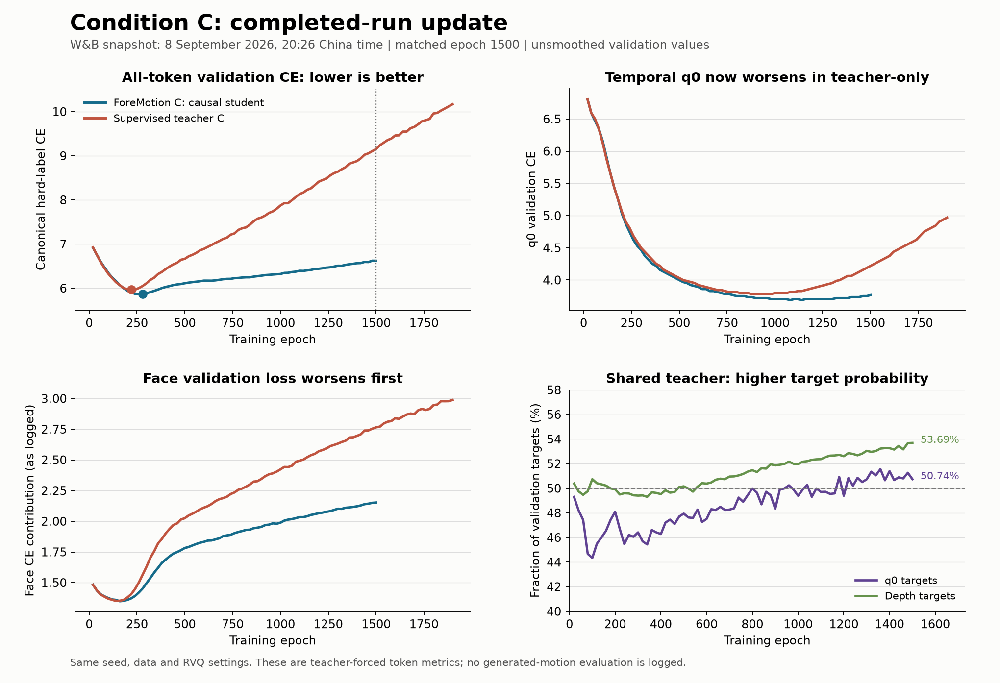

# Condition C analysis refresh — 8 September 2026, 20:26 China time

Both runs are now marked **finished** in W&B. ForeMotion last logged training
epoch 1503 and validation epoch 1500; teacher-only reached training epoch 1913
and validation epoch 1900. Neither reached the configured 10000 epochs; W&B's
finished state alone does not establish why a run ended.

Sources: [foremotion-c-rvq-scott-bs64](https://wandb.ai/wenjye00-hong-kong-university-of-science-and-technology/miburi_single/runs/0st12z6a)
and [teacher-c-supervised-rvq-scott-bs64](https://wandb.ai/wenjye00-hong-kong-university-of-science-and-technology/miburi_single/runs/8hir7gzc).
All 3082 ForeMotion and 3923 teacher history rows were freshly retrieved, with
complete unique step coverage. This report preserves the earlier snapshot in
`../wandb_2026-09-08/` and compares against its conclusions.

## What changed

1. The supervised teacher's temporal q0 validation performance has now reversed.
   The earlier statement that q0 continued improving no longer describes the
   later teacher-only checkpoints. Overfitting now affects all body parts and q0.
2. ForeMotion retains substantially better late validation performance. At the
   new shared epoch 1500, its overall CE is 27.65% lower than teacher-only.
3. ForeMotion's shared C teacher develops a small but consistent late depth
   advantage. The previous near-tie interpretation should be softened, although
   the measured advantage remains small and does not establish motion quality.
4. Best overall-CE checkpoints remain unchanged: ForeMotion epoch 280 and
   teacher-only epoch 220. No generated-motion evaluation metrics were added.

## Compare the same epoch

The teacher ran longer, so its final validation at 1900 should not be substituted
for its epoch-1500 values in a matched comparison.

| Validation metric at epoch 1500 | ForeMotion causal student | Supervised C teacher |
| --- | ---: | ---: |
| Overall CE | **6.619849** | 9.150249 |
| q0 CE | **3.765625** | 4.218750 |
| q0 accuracy | **25.2444%** | 20.4889% |
| q0 top-5 accuracy | **52.1185%** | 45.5704% |
| Upper-body CE contribution | **2.558960** | 3.132634 |
| Lower-body CE contribution | **1.908658** | 3.252599 |
| Face CE contribution | **2.152231** | 2.765017 |

The overall gap is 2.530401 CE, equivalent to 27.65% lower CE for ForeMotion,
and q0 accuracy differs by 4.7556 percentage points. This percentage describes
token cross-entropy, not a percentage improvement in generated gesture quality.
The lower-body contribution now accounts for 53.1% of that gap, face for 24.2%,
and upper body for 22.7%. The difference is no longer predominantly facial.

## Teacher-only now overfits q0 too

Teacher q0 CE reaches its minimum, 3.78125, at epochs 880–980. Its best q0
accuracy is 25.1556% at epoch 900. By epoch 1900:

- q0 validation CE rises to **4.96875**, 31.41% above its minimum.
- q0 validation accuracy falls to **16.1037%**, down 9.0519 percentage points.
- q0 training accuracy reaches **81.3339%**, while training q0 CE falls to 0.8209.
- Overall validation CE reaches **10.168252**, 70.55% above its best value.

The q0 comparison avoids the face/RVQ weighting differences between total
training and validation CE: q0 uses canonical hard targets. Its training and
held-out trajectories provide strong evidence of overfitting. Validation q0
entropy also falls from 3.5178 at epoch 900 to 2.5151 at 1900 while accuracy
deteriorates, consistent with increasing overconfidence. A lower entropy metric
should not be treated as a better checkpoint by itself.

ForeMotion's q0 also starts deteriorating, but mildly: its best q0 CE is 3.6875
at epochs 1080 and 1140, rising to 3.765625 at 1500 (+2.12%). Its best q0 accuracy
is 26.1037% at 1140, versus 25.2444% at 1500. Overall CE rises 12.89% from its
epoch-280 minimum, and face loss still explains approximately 92.6% of its own
net deterioration from 280 to 1500.

## Shared teacher: modest late benefit appears

At epoch 1500, ForeMotion's directly paired regret diagnostics show:

| Metric | Causal student | Shared C teacher | Teacher improvement |
| --- | ---: | ---: | ---: |
| q0 CE | 3.763840 | 3.759718 | 0.004122 lower |
| q0 accuracy | 25.2444% | 25.2593% | +0.0148 percentage points |
| Depth CE | 6.770201 | 6.750197 | 0.020004 lower |
| Depth accuracy | 9.1844% | 9.2546% | +0.0702 percentage points |

The teacher gives the correct target higher probability on 50.7407% of q0
positions and 53.6889% of depth positions. These percentages are target-probability
win rates, not accuracy gains.

Across the 43 newly observed validations, epochs 660–1500, teacher depth CE is
lower at all 43 and depth accuracy higher at 41. Mean depth CE gain is about
0.00996. q0 CE is lower at 31 of 43 points, but q0 accuracy is higher at only 18.
The latest relative CE reductions are approximately 0.11% for q0 and 0.30% for
depth. Therefore a small late predictive benefit from the C view is visible;
it remains far smaller than the differences between the two training regimes.

Raw validation KL rises from 0.003278 at epoch 640 to 0.013572 at 1500.
Rising disagreement does not itself imply better teaching. Here it coexists
with a small teacher advantage and worsening absolute depth CE for both views.
Training KL at 1500 is 0.054697; weighted by 6, it contributes approximately
0.32818, versus the logged training CE component 3.21282.

The causal student versus directly supervised teacher comparison changes both
inference visibility during training and the training objective. It cannot alone
establish that future-aware knowledge transfer caused ForeMotion's advantage.
A matched causal no-KL baseline and a same-mask consistency control are still
needed to distinguish future privilege from general regularization.

## Checkpoints to evaluate

| Selection goal | ForeMotion | Teacher-only |
| --- | --- | --- |
| Best overall validation token CE | **epoch 280: 5.864194** | **epoch 220: 5.962052** |
| Temporal q0 candidate | **epoch 1140: CE 3.6875, accuracy 26.1037%** | **epoch 900: CE 3.78125, accuracy 25.1556%** |
| Last validation | epoch 1500: CE 6.619849 | epoch 1900: CE 10.168252 |

The temporal candidates combine a tied minimum q0 CE with each run's best q0
accuracy. They are not the best all-codebook checkpoints. The best-versus-best
overall CE difference is still only 1.64%; the much larger late gap primarily
reflects different resistance to overfitting.

Evaluate `last_280.safetensors` and `last_220.safetensors` first for full gesture
quality, and include the temporal candidates if evaluating temporal planning.
File presence was not checked remotely. Use identical full-utterance evaluation
data, generation settings, and seeds. Comparing one teacher checkpoint under
C versus causal speech visibility would directly test its dependence on future
speech without changing its weights.

## Unchanged constraints

No hyperparameters changed from the earlier snapshot; only internal W&B
metadata changed. Both runs still use 477 training clips, 54 validation clips,
batch 64, 320.8M trainable parameters, and unfrozen speech embedding tables.
The recorded final learning rates are 9.5751e-5 for ForeMotion and 9.2731e-5
for teacher-only, only 4.25% and 7.27% below the initial 1e-4. The cosine schedule
is still very gradual relative to the observed overfitting because its endpoint
is epoch 10000. Shorter decay and freezing pretrained speech embeddings remain
separate, untested ablations; these reports do not establish they will solve it.

Neither history contains `eval/*` generated-motion metrics. These remain
teacher-forced, ten-second-clip token results, not complete-utterance generation
results. There is one seed and a small validation set, so checkpoint differences
are descriptive rather than statistical evidence across repeated experiments.

Total training and validation CE use different weighting and target objectives;
this report compares each metric's trajectory over time and the same validation
metric across runs. Paired regret CE removes PAD and uses float32, unlike the
main q0 CE computation, so their raw q0 CE values should not be interchanged.

Only local report artifacts were created. No training code/configuration or
W&B run was changed. `analyze_snapshot.py` reproduces the PNG/SVG chart and
`comparison.json` from the downloaded raw JSON histories.
